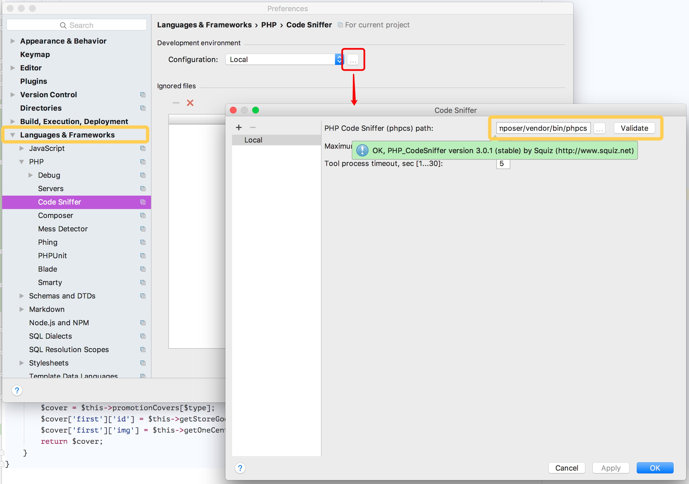
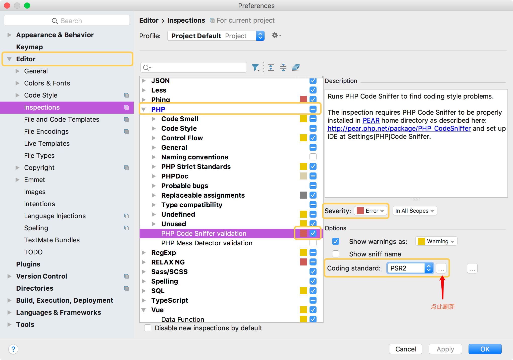
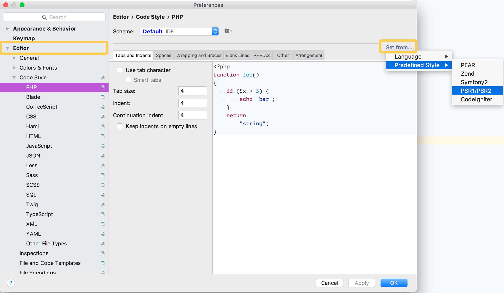

# PHP 编程规范

### 一、目录规范

为消除 Linux 上大小写明暗造成的影响，所有的目录名称必须为小写，单词之间用短横线 `-`  分割。比如 `controllers` ，`wechat-message` 。

### 二、编程规范

代码规范需要遵循 `PSR-1`、 `PSR-2`、 `PSR-4` 。具体文档如下：

[PSR-1：基础代码规范](https://segmentfault.com/a/1190000004645035)

[PSR-2：编码样式指南](https://segmentfault.com/a/1190000004649320)

[PSR-4：自动加载规范](https://segmentfault.com/a/1190000004649329)

### 三、审查工具

PHP 开发工具统一为 `PHP Storm`, 审查工具为 `CodeSniffer` 。配置过程如下：

1. ##### 需要的环境

   - PHP
   - PHP Composer (请自行搜索安装)
   - PHP Storm

2. ##### 全局安装 `CodeSniffer`

   ```shell
   composer global require "squizlabs/php_codesniffer=*"
   ```

   安装完毕，需要找到安装目录，获得 `phpcs` 这个文件的路径。

   ```shell
   cd ~/.composer/vendor/bin
   pwd
   /Users/whoyouare/.composer/vendor/bin
   ```

   `phpcs` 路径为： `/Users/whoyouare/.composer/vendor/bin/phpcs`

3. ##### PHP Storm 配置 CodeSniffer

   

   ​

   1. 打开PHP Storm 配置，按图找到 Languages&Frameworks - >PHP -> Code Sniffer
   2. 点击 Configuration 后的按钮，打开 CodeSniffer 配置窗口
   3. 将 phpcs 路径填进去，点击 Validate, 如果弹出图中绿色 tooltip表示配置成功

4. ##### 配置 Inspections 审查

   ##### 

   1. 找到 Editor -> Inspections -> PHP -> PHP Code Sniffer validation
   2. 选中勾上，然后点击右侧 `Coding Standard `， 如果看不到 PSR2 ,请点击后面按钮刷新。
   3. 修改 Severity 确认错误等级。

5. ##### 配置 Code Style

   

   

   1. 找到 Editor -> Code Style -> PHP
   2. 点击右上角 `set from`如图所示，选中 Predefined Style -> PSR1/PSR2
   3. 根据需求进行微调。

   ​