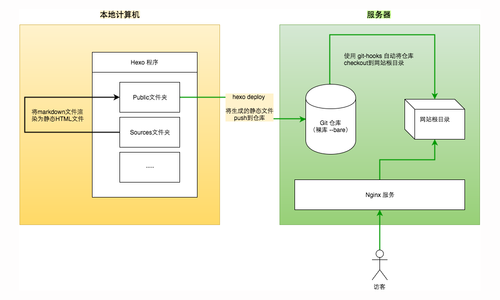

## 一、博客的架构
先搞明白Hexo博客从搭建到自动发布的架构，才能更好的理解我们每一步进行的操作。
不然只跟着步骤过了一遍，却不知道为什么这么做。

首先看这张架构图：


整个流程就是本地将 `*.md` 渲染成静态文件，然后Git推送到服务器的`repository`,服务器再通过 `git-hooks` 同步网站根目录。

## 二、整个搭建流程

**第一部分**: 服务器环境搭建，包括安装 `Git` 、`Nginx`配置 、创建 `git` 用户 。

**第二部分**: 本地`Hexo`初始化， 包括安装 `NodeJS` 、`hexo-cli`, 生成本地静态网站

**第三部分**: 使用Git自动化部署发布博客

## 三、 服务器环境搭建

#### 3-1. 安装Git和NodeJS (CentOS 环境)

```sh
yum install git
#安装NodeJS
curl --silent --location https://rpm.nodesource.com/setup_5.x | bash -
```

NodeJS 安装可以参考： [Linux安装NodeJS](https://nodejs.org/en/download/package-manager)

#### 3-2. 创建git用户

```sh
adduser git
chmod 740 /etc/sudoers
vim /etc/sudoers
```

找到以下内容

```sh
## Allow root to run any commands anywhere
root    ALL=(ALL)     ALL
```

在下面添加一行

```sh
git   ALL=(ALL)     ALL
```

保存退出后改回权限

```sh
chmod 400 /etc/sudoers
```

随后设置Git用户的密码，

```sh
#需要root权限
sudo passwd git
```

切换至git用户，创建 `~/.ssh` 文件夹和 `~/.ssh/authorized_keys `文件，并赋予相应的权限

```sh
su git
mkdir ~/.ssh
vim ~/.ssh/authorized_keys
#然后将电脑中执行 cat ~/.ssh/id_rsa.pub | pbcopy ,将公钥复制粘贴到authorized_keys
chmod 600 ~/.ssh/authorzied_keys
chmod 700 ~/.ssh
```

然后就可以执行ssh 命令测试是否可以免密登录

```sh
ssh -v git@SERVER
```

至此，Git用户添加完成

#### 3-3. Nginx安装和配置
我是用的是lnmp 一键安装包，nginx安装教程一大堆，就不再叙述。主要看nginx配置。
找到nginx的配置文件，修改配置如下：

```sh
server
{
    listen 80;
    #listen [::]:80;
    server_name www.seekbetter.me seekbetter.me;
    index index.html index.htm index.php default.html default.htm default.php;
    #这里要改成网站的根目录
    root  /path/to/www;  

    include other.conf;
    #error_page   404   /404.html;
    location ~ .*\.(ico|gif|jpg|jpeg|png|bmp|swf)$
    {
        access_log   off;
        expires      1d;
    }

    location ~ .*\.(js|css|txt|xml)?$
    {
        access_log   off;
        expires      12h;
    }

    location / {
        try_files $uri $uri/ =404;
    }

    access_log  /home/wwwlogs/blog.log  access;
}
```

## 四、 本地Hexo程序

#### 4-1. 初始化Hexo博客

首先要安装 `hexo-cli`，安装`hexo-cli` 需要 root 权限，使用 `sudo` 运行

```sh
sudo npm install -g hexo-cli
```
然后初始化Hexo程序

```sh
cd ~/Documents/code
hexo init blog
```
等执行成功以后安装两个插件， `hexo-deployer-git` 和 `hexo-server` ,这俩插件的作用分别是使用Git自动部署，和本地简单的服务器。

[hexo-deployer-git帮助文档](https://github.com/hexojs/hexo-deployer-git)
[hexo-server帮助文档](https://hexo.io/zh-cn/docs/server.html)

```sh
cd blog
npm install hexo-deployer-git
npm install hexo-server
```
#### 4-2. 生成自己的第一篇文章 hello world !
使用 `hexo new <文章名称>` 来新建文章，该命令会成成一个 `.md`文件放置在 `sources/_posts`文件夹。
```sh
hexo new "hello Hexo"
vim sources/_posts/hello-hexo.md
```
编辑完毕以后， 使用`hexo g`将 `.md`文件渲染成静态文件，然后启动`hexo-server`：
```sh
hexo g
hexo server
```
现在便可以打开浏览器访问 `http://localhost:4000` 来查看我们的博客了！

## 五、自动化部署

#### 5-1. 服务器上建立git裸库

创建一个裸仓库，裸仓库就是只保存`git`信息的`Repository`, 首先切换到`git`用户确保`git`用户拥有仓库所有权
一定要加 `--bare`，这样才是一个裸库。

```sh
su git
cd ~
git init --bare blog.git
```

#### 5-2. 使用 git-hooks 同步网站根目录
在这里我们使用的是 `post-receive`这个钩子，当git有收发的时候就会调用这个钩子。 在 `~/blog.git` 裸库的 `hooks`文件夹中，
新建`post-receive`文件。
```sh
vim ~/blog.git/hooks/post-receive

#!/bin/sh
git --work-tree=/path/to/www --git-dir=~/blog.git checkout -f
```
保存后，要赋予这个文件可执行权限
```sh
chmod +x post-receive
```
#### 5-3. 配置`_config.yml`,完成自动化部署

然后打开 `_config.yml`, 找到 `deploy`

```javascript
deploy:
	type: git
	repo: git@SERVER:/home/git/blog.git    //<repository url>
    branch: master            //这里填写分支   [branch]
    message: 提交的信息         //自定义提交信息 (默认为 Site updated: {{ now('YYYY-MM-DD HH:mm:ss') }})
```

保存后，尝试将我们刚才写的"hello hexo"部署到服务器

```sh
hexo clean
hexo generate --delpoy
```

访问服务器地址，就可以看到我们写的文章"Hello hexo",以后写文章只需要：
```sh
hexo new "Blog article name"
···写文章
hexo clean && hexo generate --deploy
```
博客就更新咯！~


#### 参考资料：

[使用 Git Hook 自动部署 Hexo 到个人 VPS](http://www.swiftyper.com/2016/04/17/deploy-hexo-with-git-hook/)
[Hexo 文档](https://hexo.io/zh-cn/docs/)
