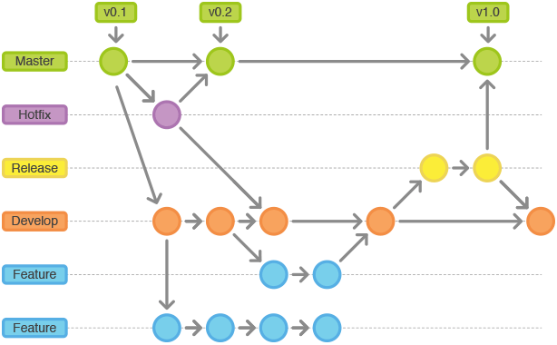

平时在使用Git时候，如果有冲突，就需要一次合并提交， 导致整个`git` 主线很乱，而且经常的合并比较容易出现问题。 这样是 `non fast-forward` 合并。

可以看下这边文章，这篇文章是我们现在用的方法：

[解决合并的冲突 - non fast-forward合并 ](http://backlogtool.com/git-guide/cn/stepup/stepup2_7.html)

我们要改为用 `rebase` 进行合并， 这样就可以是 `fast-forward` 合并了，请查看这边文章

[rebase 合并的冲突 - fast-forward合并 ](http://backlogtool.com/git-guide/cn/stepup/stepup2_8.html)

## 一、Git 使用最佳实践

### 提交对应改动

一次提交要包括一个相关改动。例如，对于两个错误的修复应该进行两次不同的提交。精简的提交可以让其他的开发团队人员更简单地明白其改动的用义。如果其中一次提交的改动出现了问题，也可以方便地回滚到改动之前的状态。借助暂存功能来标记相关的改动文件，Git 可以为你打造出非常精准的提交。

### 频繁地提交改动

经常性地提交改动可以确保不会出现特别庞大的提交，同时也可以比较精准地对应到所需要的改动上。此外，通过频繁地提交也可以比较快速地和其他开发人员来共享你的改动。同样也会避免在整合代码时出现过多的合并冲突。相反的，非常庞大的提交会加大整合代码时出现冲突的风险，解决这些冲突也会非常复杂。

### 不要提交不完整的改动

虽然原则上来说不要提交一些还没有完成的改动，但是对于一个非常庞大的新功能来说，也并不意味着你必须整体完成这个功能后才可以提交。恰恰相反，你必须把那些改动正确地分割成一些有意义的逻辑模块来进行频繁地提交。如果你仅仅是因为急着想要下班，或者是想要得到一个干净的工作副本（比如想要切换到另一个分支上），你可以利用 Git 所提供的储藏（Stash）功能来解决这些问题。切记不要把那些不完整的改动提交到仓库中。

### 提交前测试那些改动

不要理所当然地认为自己完成的改动都是正确的。所有的改动一定要通过彻底地测试才表示它真正地被完成了。尽管这些改动可能仅仅是提交到了你的本地仓库中，只有你自己才能看到，但完整的测试同样是非常重要的，因为这些代码可能之后会被推送和共享到远程给其他的开发人员。

## 二、分支管理

1. `Production`
    图中的 `Master` 分支就是我们的 `Production` 分支。` Production` 分支是服务器正在运行的，合并上去之后需要打 ` Tag`。 

2. `Develop`

    Develop分支就是我们的 dev 分支，`develop`分支作为功能的集成分支。

3. `hotfix/*`

    但功能分支不是从`production`分支上拉出新分支，而是使用`dev`分支作为父分支。当新功能完成时，合并回`dev`分支。功能分支不允许直接合并到`production` 分支。

4. `release/*`

    功能发布分支，一旦`dev`分支上有了做一次发布（或者说快到了既定的发布日）的足够功能，就从`dev`分支上`fork`一个发布分支。 新建的分支用于开始发布循环，所以从这个时间点开始之后新的功能不能再加到这个分支上—— 这个分支只应该做`Bug`修复、文档生成和其它面向发布任务。 一旦对外发布的工作都完成了，发布分支合并到`production`分支并分配一个版本号打好`Tag`。 另外，这些从新建发布分支以来的做的修改要合并回`dev`分支。

5. `name/*`

    功能分支，`name` 为开发者的名称。当一个功能需要多个人进行合作开发的时候，用 `feature/*`


## 三、Git 使用规范

`commit` 的时候必须跟上` issue` 的 `ID`， 格式如下：

```
Commit的内容 (#122)
```


## 四、工作流程

1. 去自己的工作分支

```sh
	$ git checkout work
```

然后开始工作，开发功能修复BUG
....

2. 提交工作分支的修改  

```sh
	$ git commit -a
```

3. 回到主分支  

```sh
	$ git checkout dev
```

4. 获取远程最新的修改，此时不会产生冲突  

```sh
	$ git pull
```

5. 回到工作分支

```sh
	$ git checkout work
```

6. 用`rebase`合并主干的修改，如果有冲突在此时解决

	$ git rebase dev

7. 冲突解决完毕后

```sh
	$ git rebase --continue
```

8. 回到主分支  

```sh
	$ git checkout dev
```

9. 合并工作分支的修改，此时不会产生冲突。

```sh
	$ git merge work
```

10. 提交到远程主干

```sh
	$ git push
```

这样做的好处是，远程主干上的历史永远是线性的。每个人在本地分支解决冲突，不会在主干上产生冲突。


具体的操作流程请参考：[Git Flow 工作流程]( https://segmentfault.com/a/1190000002918123#articleHeader10)