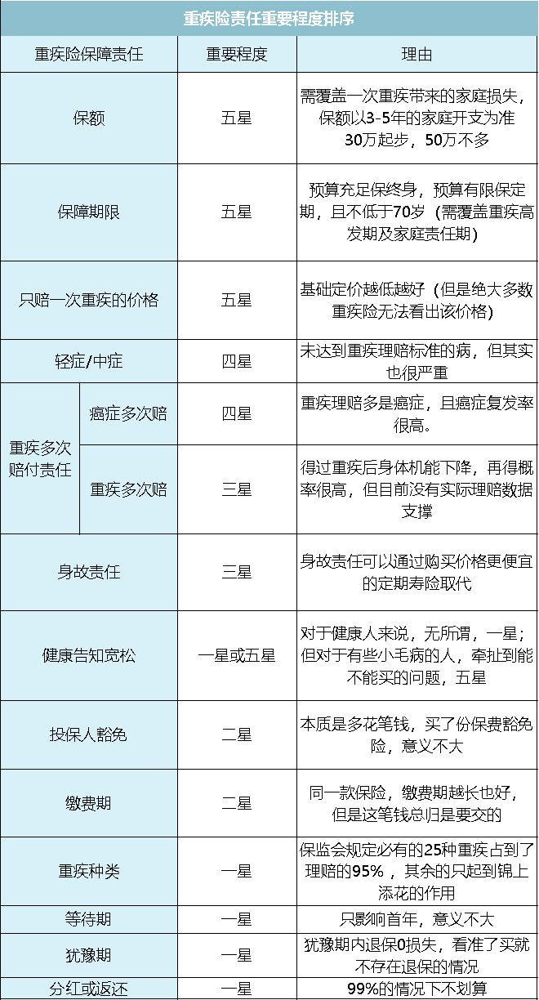

## 一、保险的赔付能力

长话短说：国家一行三会，央行、银监会、证监会、保监会管理整个金融市场。保监会对保险公司的赔付能力进行监督，还通过中国保险保障基金对保险公司进行兜底。每家保险公司都需要有牌照才能营业，牌照国内根据保险业务类别一共有4种牌照：人寿保险、健康险、养老险和财产险。其中前3种牌照在目前情况下大部分经营范围实际是重叠的，所以可以认为是同一种，即人身险牌照。也就是我们常说的保险公司只分为两种：**寿险（说人身险、人寿保险也是一个意思）**公司和**财险公司**。

这里讲这些主要想说明：**无论大公司还是小公司，只有服务上的差异，赔付上都会有保障**。更具体的请参考[李元霸-如何用保险保障自己的一生](https://www.zhihu.com/question/22316395/answer/100909780)

## 二、保险的种类

对的，在专业人员眼里，**人身险产品按照保险责任只分为三种：寿险、健康险和意外险**。

**寿险**：不论是意外、自然还是疾病导致的身故都会赔付保额。可以买终身，意味着 100% 会拿到保额，也就是`儿孙福`。寿险更大的作用是买到60岁，也就是孩子成家立业了，这时候倒了也不会影响家庭生活质量。说是被保人，其实是保障的家庭。

**健康险**： 分为重疾险和医疗保险。 重疾险是有病立即赔付，医疗险是先自己掏钱然后进行报销。所以要进行搭配，重疾用于先付钱，医疗用于事后报销。

**意外险**：顾名思义，只有意外导致的身残或身故会赔付。保费相对较低。

再说到某个具体产品，**我国保险产品是有命名规则的，大致为：保险公司名称 + 可选的吉庆名字 + 具体保险类型。**

（1）**平安平安福终身寿险**（主险，前两字“平安”即代表命名公式里面的保险公司名称、“平安福”代表吉庆名字、“终身寿险”代表这产品为个人寿险中的终身寿险）

（2）**平安附加平安福提前给付重大疾病保险（2014）**（附加险，前两字“平安”即代表命名公式里面的保险公司名称、“附加”代表是附加险、“平安福”代表吉庆名字、“提前给付重大疾病保险”代表这产品为个人健康险中的重大疾病保险，保险金给付形式是提前给付、“2014”代表2014年开发版本，2014也不代表啥，不一定保障内容就没有2016的新，也纯粹就是个命名后缀）

除了了平安福主险和附加重疾险外还有6个附加险，从名字大致就可以看出它们的保障内容是什么，不再赘述。

## 三、保险术语

1. 犹豫期

   在犹豫期内可以取消保单。

2. 等待期

   投保后一般需要 90 天的等待保险才正式生效。

3. 重疾分组

   只有多次赔付才会用到，多次赔付的疾病需要是不同的组别。单次重疾险没有分组。

4. 身故返还

   在保险期间，不论什么原因导致的身故，返还现金保费现金价值或者保额。如果是终身险，相当于多花钱买了一份保额为所交保费的终身寿险。一般不推荐，因为可以那这笔钱买一份定期寿险。

5. 轻症中症赔付

   中症和轻症各有几次赔付，不影响重疾赔付。 一般中症是 基本保额 * `50%`， 轻症是 基本保额 * `30%`。中症和轻症还是很有必要的，墨菲定律告诉我们一定会发生，群体的概率放在个体那就是 `0` 和 `100%`。

6. 投保人豁免

   若投保人在等待期后发生疾病，将豁免自确诊之日起后续未交保费，被保险人的保障继续有效。夫妻可以相互豁免，这样只要有一个人生病，两个人都不用交保费。

7. 现金价值

   我们所交的长期重疾险的保费，一般来说会随着年龄增加保费增加，尤其是到老年，保险公司承担的风险会越来越大，所以，保费理应随着年龄的增长而逐年增加。

   保险公司为了防止投保人在年老后负担不了保费，会采取“均衡费率”，算出总体的保费，然后均摊到每个年龄段，所以在保障的前几年，我们所交的保费是远高于实际保障成本的，这样就有一部分钱“存”在了保单上，用来交年龄大时少收取的保费。

   这部分“存”在保单上的钱，就是保单的现金价值，且保单的现金价值，会逐渐增加，再慢慢减少，直到保单失效，合同终止，现金价值就会变为0：

   这里补充一句：如果投保30年，中途退保，会返还现金价值。

## 四、重疾险纬度

## 五、我的选择

不考虑储蓄型的保险，因为不如买基金。资金预算有限的情况下，重疾险和医疗险应该是最应该买的。

1. 重疾险：[百年康惠保（2020版）重大疾病保险](http://www.kaixinbao.com/jiankang-baoxian/321174.shtml)

   终身，交30年， 保额50万，仅选择了`二次肿瘤`附加条款，一年保费 5200 +。

2. 医疗险：支付宝- 好医保-长期医疗

3. 定期寿险： 暂时未定