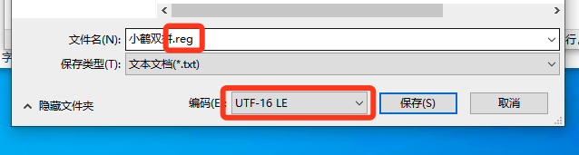

Win10 双拼方案默认不包含`小鹤双拼`, 可以通过修改注册表进行添加。 

每次装完系统都需要打开注册表，查找KEY然后新建字符串感觉比较麻烦。于是写成 `.reg` 文件。 但是小鹤双拼中文字符在注册表中是乱码。 原来是需要保存为 `UTF-16 LE` 模式。

新建 `.txt` 文件，输入以下内容

```
Windows Registry Editor Version 5.00
[HKEY_CURRENT_USER\Software\Microsoft\InputMethod\Settings\CHS]
"UserDefinedDoublePinyinScheme0"="小鹤双拼*2*^*iuvdjhcwfg^xmlnpbksqszxkrltvyovt"
```

保存的时候一定要注意选择 `UTF-16 LE`,  并把名称后缀改为`.reg`。



以后双击就可以了。怕麻烦可以直接点击下载： [小鹤双拼.reg](/小鹤双拼.reg)